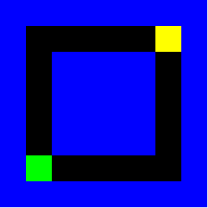

<div align="center"></div>
<h1 align="center">maze</h1>
<p align="center"><strong>A full maze game implementation written completely using only MIPS assembly.</strong></p>
<br>
<div align="center"></img></div>
<h2>About</h2>
This project was made for the course "Computer Systems and Architecture" at the University of Antwerp.

<h2>Goal and requirements</h2>

The goal of this project was to build an application using the MIPS assembly language only.

The idea behind first implementation. What is expected, what should be included, what should not be included.

<h2>Prerequisites</h2>

<h3>Mars Mips Simulator</h3>

In order to play the maze game, you'll need to

<h2>Installation</h2>

1. Download this project as zip and extract it
2. Import it in Android Studio
3. Sync Gradle and run on your device/emulator

Make sure all the files are in the same directory, it should look something like this:

```
maze-game
└───input.txt
└───input_large.txt
└───maze.asm
└───maze_extension.asm
└───Mars?_?_?.jar
└───README.md
```

<h2>Usage</h2>

After installing, open `Mars?_?_?.jar`.

- In the menubar, select Tools->Bitmap Display
- Set the base address for display on `0x10008000 ($gp)`
- Fix the width and height accordingly.
- Build the project.
- Run the code.

If you're running the extension version, you should see the maze solving itself using the [depth first search](https://en.wikipedia.org/wiki/Depth-first_search) algorithm

<h2>Contributing</h2>
Contributions are what make the open source community such an amazing place to learn, inspire, and create. Any contributions you make are greatly appreciated.

If you have a suggestion that would make this better, please fork the repo and create a pull request. You can also simply open an issue with the tag "enhancement". Don't forget to give the project a star! Thanks again!

1. Fork the Project
2. Create your Feature Branch (`git checkout -b feature/AmazingFeature`)
3. Commit your Changes (`git commit -m 'Add some AmazingFeature'`)
4. Push to the Branch (`git push origin feature/AmazingFeature`)
5. Open a Pull Request

<h2>Credits</h2>

- My professor [Hans Vangheluwe](https://github.com/HansVangheluwe) and assistants [Stephen Pauwels](https://github.com/StephenPauwels) and [Brent van Bladel]()

<h2>Copyright</h2>
This project is licensed under the terms of the MIT license and protected by Udacity Honor Code and Community Code of Conduct. See <a href="LICENSE.md">license</a> and <a href="LICENSE.DISCLAIMER.md">disclaimer</a>.
