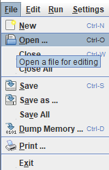

<div align="center"></div>
<h1 align="center">maze</h1>
<p align="center"><strong>A full maze game implementation written in MIPS assembly.</strong></p>
<br>
<div align="center"></img></div>
<h2>About</h2>
This project was made for the course "Computer Systems and Architecture" at the University of Antwerp.

<h2>Goal</h2>

The goal of this project was to build an application using the MIPS assembly language only.

<h2>Prerequisites</h2>

<h3>Mars Mips Simulator</h3>

In order to play the maze game, you'll need to install the Mars Mips simulator.

You can find a download link to the simulator on [the official site of the Missouri State University](https://courses.missouristate.edu/KenVollmar/MARS/).

Alternatively, you could grab an unofficial modification from [this github repo](https://github.com/aeris170/MARS-Theme-Engine), which supports modern themes such as Atom One Dark.

<h3>Java</h3>

If you don't have java installed already, you can grab it [here](https://www.java.com/en/download/).

<h2>Installation</h2>

1. Clone the repository
2. Put the installed `Mars[version here].jar` in the same directory as the cloned repo

All the files must be in the same directory. Your folder structure should look like this:

```
maze-game
└───input.txt
└───input_large.txt
└───maze.asm
└───maze_extension.asm
└───Mars_[version here].jar
└───README.md
...
```

<h2>Usage</h2>

1. Launch `Mars[version here].jar`.

2. In the menubar, select File->Open and select either `maze.asm` or `maze_extension.asm`
<br>

3. In the menubar again, navigate to Tools->Bitmap Display

4. Set the base address for display on `0x10008000 ($gp)`

5. Fix the width and height accordingly.<br><div align="center"></img></div>

6. Build the project by clicking the build icon in the toolbar.<br> 

7. Run the code by clicking the run icon in the toolbar. <br>

### maze.asm

If you're running `maze.asm`, you can solve the maze using the controls:

|key|direction|
|---|---------|
| w | forward |
| a | left    |
| s | down    |
| d | right   |

### maze_extension.asm

If you're running the extension version, you should see the maze solving itself using the [depth first search](https://en.wikipedia.org/wiki/Depth-first_search) algorithm.


## Contributing

Contributions are what make the open source community such an amazing place to learn, inspire, and create. Any contributions you make are greatly appreciated.

If you have a suggestion that would make this better, please fork the repo and create a pull request. You can also simply open an issue with the tag "enhancement". Don't forget to give the project a star! Thanks again!

1. Fork the Project
2. Create your Feature Branch (`git checkout -b feature/AmazingFeature`)
3. Commit your Changes (`git commit -m 'Add some AmazingFeature'`)
4. Push to the Branch (`git push origin feature/AmazingFeature`)
5. Open a Pull Request

## Credits

- My professor [Hans Vangheluwe](https://github.com/HansVangheluwe) and assistants [Stephen Pauwels](https://github.com/StephenPauwels) and [Brent van Bladel]()

## Copyright

This project is licensed under the terms of the MIT license and protected by Udacity Honor Code and Community Code of Conduct. See <a href="LICENSE.md">license</a> and <a href="LICENSE.DISCLAIMER.md">disclaimer</a>.
